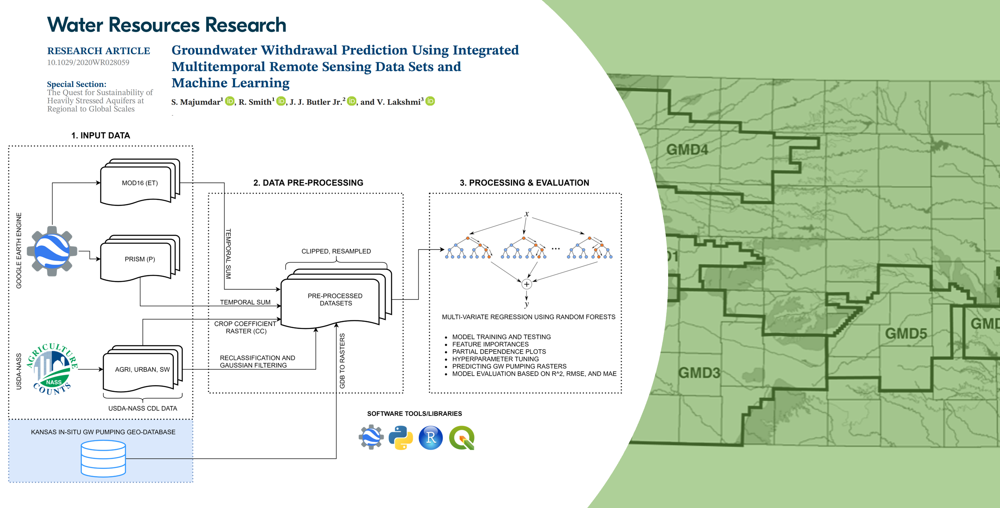

# HydroMST



Source codes for groundwater pumping prediction using integrated remote sensing datasets and machine learning

The remote sensing data sets can be automatically downloaded using the project code.

Anaconda3 environment is required for successfully running the codes.

Related research article:  https://doi.org/10.1029/2020WR028059

Citation:
```
@article{https://doi.org/10.1029/2020WR028059,
author = {Majumdar, S. and Smith, R. and Butler Jr., J. J. and Lakshmi, V.},
title = {Groundwater Withdrawal Prediction Using Integrated Multitemporal Remote Sensing Data Sets and Machine Learning},
journal = {Water Resources Research},
volume = {56},
number = {11},
pages = {e2020WR028059},
keywords = {Groundwater hydrology, Remote sensing, Machine learning, Time series analysis, Estimation and forecasting, Geospatial},
doi = {https://doi.org/10.1029/2020WR028059},
url = {https://agupubs.onlinelibrary.wiley.com/doi/abs/10.1029/2020WR028059},
eprint = {https://agupubs.onlinelibrary.wiley.com/doi/pdf/10.1029/2020WR028059},
note = {e2020WR028059 2020WR028059},
year = {2020}
}
```